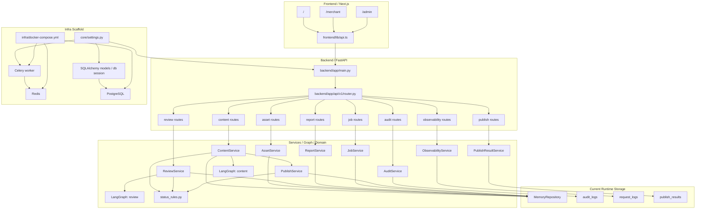
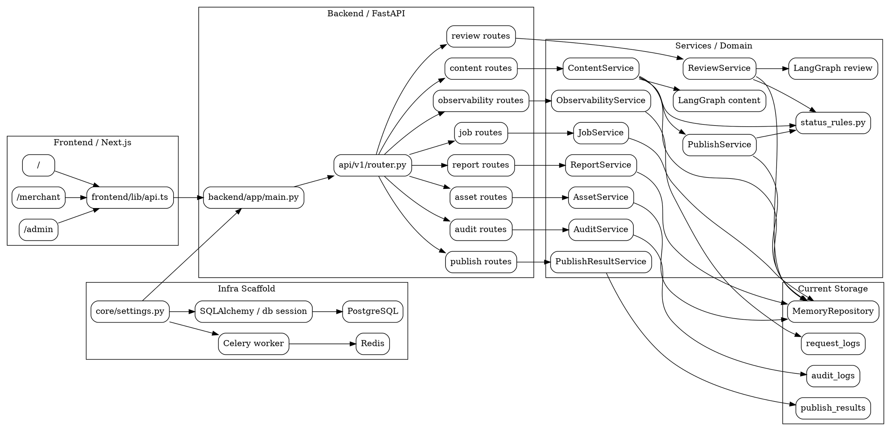
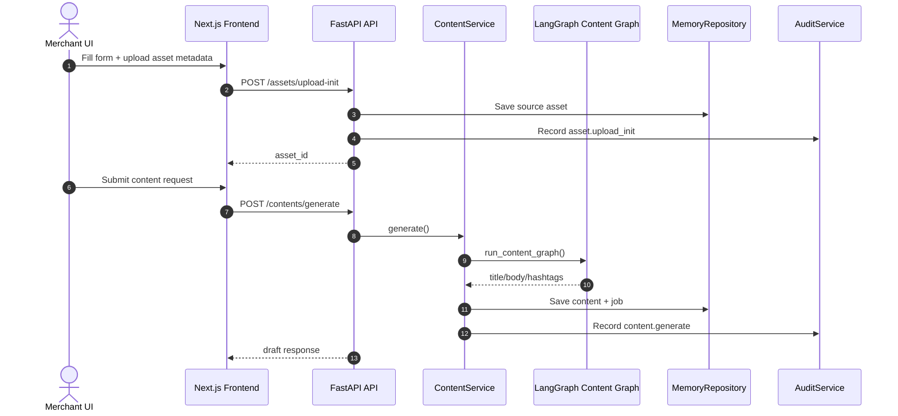
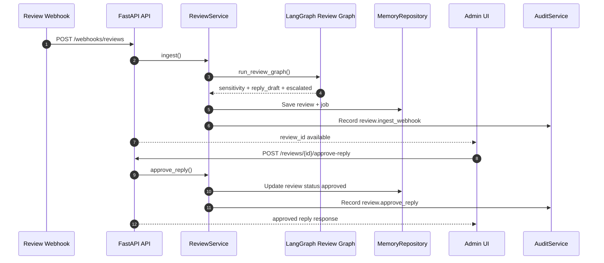
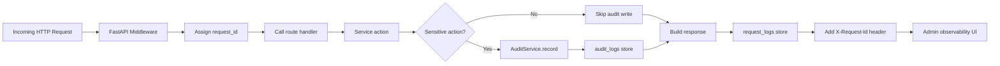
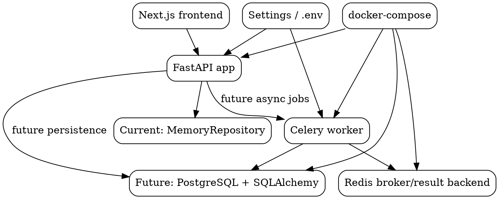

# Project Diagrams

## Mermaid



## Graphviz DOT



## System Sequence



## Content Flow

```mermaid
flowchart LR
    A[Merchant Form Input] --> B[frontend/lib/api.ts]
    B --> C[POST /api/v1/contents/generate]
    C --> D[ContentService.generate]
    D --> E[Asset Ownership Validation]
    E --> F[LangGraph Content Graph]
    F --> G[Draft Content Fields]
    G --> H[Save content in repository]
    H --> I[Create content_generate job]
    I --> J[Write audit log]
    J --> K[Return draft response]
```



## Publish And Variant Flow

```mermaid
flowchart TB
    A[Admin UI] --> B[POST /contents/{id}/publish]
    B --> C[ContentService.publish]
    C --> D[PublishService.publish_content]
    D --> E{Approved Content?}
    E -- No --> X[409 CONTENT_NOT_APPROVED]
    E -- Yes --> F{apply_image_variant?}
    F -- No --> H[Create publish job]
    F -- Yes --> G[Nano Banana Stub Adapter]
    G --> G1[Create variant assets]
    G1 --> G2[Create image_variant_generate job]
    G2 --> H[Create publish job]
    H --> I{Platform == blog?}
    I -- Yes --> J[blog_publish_adapter.publish_post]
    I -- No --> K[internal_stub result]
    J --> L[Save publish_result]
    K --> L[Save publish_result]
    L --> M[Update content status scheduled]
    M --> N[Write audit log]
    N --> O[Return publish response]
```

## Review Approval Flow



## Audit And Observability Flow



## Worker And Infra Flow


